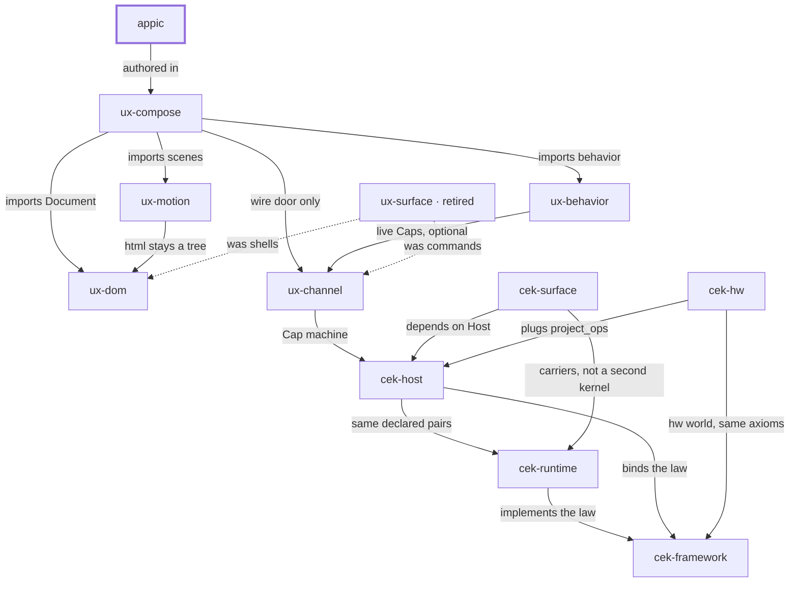

# Place in the stack

**You are here:** `appic` in [bitplorer/appic](https://github.com/bitplorer/appic).

A house of making you inhabit. Rooms, a kit you own, and a brand. It is authored in ux-compose. It is not a library other packages import.

The picture is the same in every repo. The thick stroke is this library. A missing line is a missing door, not a forgotten one. Dashed lines are history.

## Owns

The house: rooms, owned kit copies, Clock A (GET) and Clock B (signed action).

## Refuses

React, Vue, or JS/TS as the source of truth. HTTP verbs on page units. A second store beside Channel.

## Install

Private house. Pins ux-compose, the four specialists, and cek-host and cek-surface at 0.2.0 or newer.

## Doors

### Uses

- [ux-compose](https://github.com/bitplorer/ux-compose) — authored in

## The stack

## The walk

Mint, intent, verify, project, apply, undo.

1. **Mint.** Host mints a Cap. The subject on the Cap is the subject in the args. dev is the workshop. prod refuses the workshop secret.
2. **Intent.** Channel carries action, args, and cap. That is the click. It is not a form post.
3. **Verify.** Host verifies the Cap before any shared-world write. A bad Cap, or a store that is down, refuses. ops is empty. The peer never mints.
4. **Project.** Only declared pairs leave the host. Baseline and ui.dom are the catalog. Hardware pairs arrive through project_ops. They are not a fork of Host.
5. **Apply.** The peer applies the ops. DOM is one world. GPIO is another. Surface carries the IR. It does not decide.
6. **Undo.** Lineage records the cause. End or revoke reverses it, or the op is marked non-reversible. A trace id never grants permission.

appic is the house the walk runs in. It is not one of the six steps.

## Notes

- GET is Clock A. Action is Clock B, POST /ux-channel/action.
- Caps are seals. An empty Content-Type is a bad request.
- Doctor fails closed if the Cap host is not cek-host.
